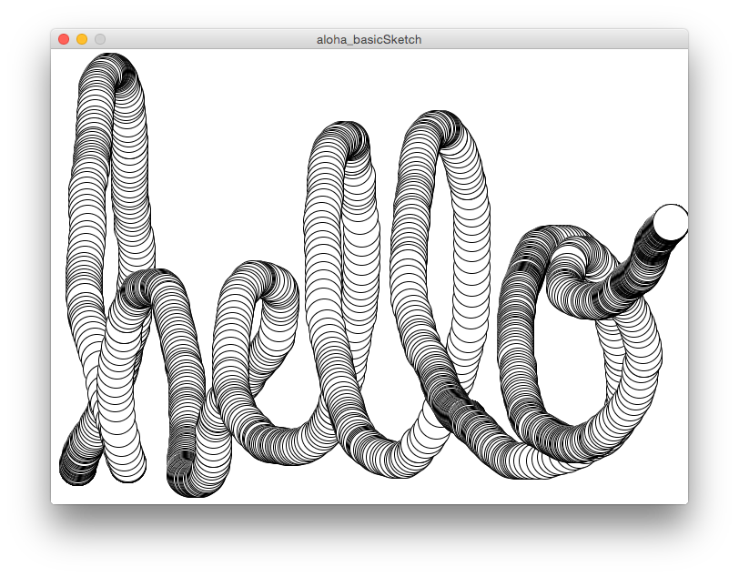

***
# Before we dive in:
### What You'll Need
+ Download [Processing](https://processing.org/download/) for your specific operating system.
+ The confidence, curiosity and enthusiasm to learn and the drive to teach yourself and the patience to help those around you.

### What you need to do:
+ Do the [One hour of code](http://hello.processing.org/) with Dan Shiffman to get familiar with Processing and the concepts we'll dive further into today.

***
# Processing Workshop 

In this workshop we will be introduced to [Processing](https://processing.org) - a programming language and environment developed "to promote literacy within the visual arts and visual literacy within technology". Processing is used across a variety of communities but has had particular success within the art and design community (and data visualization community) for its strength in generating visual and interactive output. We will will use Processing to:

1. Become familiar with the fundamental concepts of programming visual outputs with code.
2. Build our confidence in using code as a material/tool to turn our ideas into something tangible.
3. Learn about the process of deconstructing tasks into modular steps (don't worry if this doesn't mean anything to you yet!).
4. Get introduced to the ways in which code can create accountability for the visualization process. 

We will use the concepts learned in this workshop throughout the rest of the course to learn how to systematically approach data visualization problems and explore other tools and methods of producing visuals with data. 

***
# Learning Outcome / Assignment:
At the end of this workshop, you will be equipped with the fundamental tools to draw with code. With your new skills you will be able to produce all sorts of visual output using Processing's primitive shapes and programming concepts such as variables, conditionals, and loops. For your assignment choose **one** these three Proun drawings by El Lissitzsky.

You will develop **2 versions**: 

1. The first will be a version as close to the image as possible.
2. The second will be a **remix** of the image - playing with the composition through the use of alternative colors, strokeWeight, object positioning, etc. - save your code in a separate file!

Be sure to try and use **variables** -- ones that you define and in-built variables like **mouseX** and **mouseY** -- to affect the composition.

**NOTE:** You are encouraged to work together on the initial composition, but your **remixes** should all look different.

***

## Index

<!-- START doctoc generated TOC please keep comment here to allow auto update -->
<!-- DON'T EDIT THIS SECTION, INSTEAD RE-RUN doctoc TO UPDATE -->

  - [S1. Form & Code - Examples](#s1-form-&-code---examples)
  - [S2. Introduction to Processing](#s2-introduction-to-processing)
  - [S3. The Community](#s3-the-community)
  - [S4. The Processing Environment](#s4-the-processing-environment)
    - [The Text Editor & Display Window](#the-text-editor-&-display-window)
- [S5. Getting Started](#s5-getting-started)
  - [A static sketch](#a-static-sketch)
  - [A dynamic sketch](#a-dynamic-sketch)
  - [Dynamic Sketch Remix](#dynamic-sketch-remix)
    - [Saving your work](#saving-your-work)
- [S6: Fundamentals](#s6-fundamentals)
  - [S6.1: Structure](#s61-structure)
    - [S6.1.1: comments](#s611-comments)
    - [S6.1.2: Printing to the console:](#s612-printing-to-the-console)
    - [S6.1.3: functions](#s613-functions)
  - [S6.2: Shape](#s62-shape)
    - [S6.2.1: coordinates](#s621-coordinates)
    - [S6.2.2: primitives](#s622-primitives)
    - [S6.2.3: properties](#s623-properties)
      - [Basic Color properties](#basic-color-properties)
      - [Basic Stroke Properties](#basic-stroke-properties)
    - [S6.2.4: custom shapes](#s624-custom-shapes)
- [S7: Data & Variables & Computation](#s7-data-&-variables-&-computation)
  - [Arithmetic & Functions](#arithmetic-&-functions)
  - [Relational Expressions](#relational-expressions)
  - [Variables and Data Types](#variables-and-data-types)
- [S8: Control structures](#s8-control-structures)
  - [S8.1: Conditionals: if/else/else if statements](#s81-conditionals-ifelseelse-if-statements)
    - [A simple if statement](#a-simple-if-statement)
    - [A simple if/else statement](#a-simple-ifelse-statement)
      - [Challenge 1: Your first if/else statement](#challenge-1-your-first-ifelse-statement)
    - [A simple if/else if/else statment](#a-simple-ifelse-ifelse-statment)
      - [Challenge 2: Deconstructing an if/else if/else statement](#challenge-2-deconstructing-an-ifelse-ifelse-statement)
      - [Challenge 3: A simple drawing and erasing tool](#challenge-3-a-simple-drawing-and-erasing-tool)
  - [S8.3:repitition](#s83repitition)
    - [S8.3.1:The for loop](#s831the-for-loop)
  - [S9.1 Synthesis 1: Animated data line](#s91-synthesis-1-animated-data-line)
  - [S9.2 Synthesis 2: Animated taxi trail](#s92-synthesis-2-animated-taxi-trail)
- [Recap & Future Directions:](#recap-&-future-directions)
  - [What we learned today](#what-we-learned-today)
- [Future Directions](#future-directions)
  - [Endless learning](#endless-learning)
  - [P5.js](#p5js)
- [Web Searching](#web-searching)
- [References](#references)
- [Resources](#resources)
- [Appendix](#appendix)
- [S8: More on math](#s8-more-on-math)
  - [S8.1: arithmetic & functions - more examples](#s81-arithmetic-&-functions---more-examples)
    - [S8.1.1: Add](#s811-add)
    - [S8.1.2:subtract](#s812subtract)
    - [S8.1.3:multiply](#s813multiply)
    - [S8.1.4: divide](#s814-divide)
    - [S8.1.5: modulo](#s815-modulo)
    - [S8.1.6: parentheses](#s816-parentheses)
    - [S8.1.7: increment](#s817-increment)
    - [S8.1.8: decrement](#s818-decrement)
    - [s8.1.9: += (add assign), -= (subtract assign), *= (multiply assign), /= (divide assign)](#s819--add-assign---subtract-assign--multiply-assign--divide-assign)
    - [s8.1.10: ceil()](#s8110-ceil)
    - [s8.1.10: floor()](#s8110-floor)
    - [s8.1.11: round()](#s8111-round)
    - [s8.1.12: min(), max()](#s8112-min-max)
- [S9: More on Control](#s9-more-on-control)
  - [S9.1 conditionals & decision making](#s91-conditionals-&-decision-making)
    - [S9.1.1:Relational Expressions](#s911relational-expressions)

<!-- END doctoc generated TOC please keep comment here to allow auto update -->

***
##S1. Form & Code - Examples

[insert link to slides]

***

## S2. Introduction to Processing

"Processing is for writing software to make images, animations, and interactions. The idea is to write a single line of code, and have a circle show up on the screen. Add a few more lines of code, and the circle follows the mouse. Another line of code, and the circle changes color when the mouse is pressed. We call this sketching with code. You write one line, then add another, then another, and so on. The result is a program created one piece at a time. " - Casey Reas & Ben Fry, *Getting Started With Processing*

"Processing relates software concepts to principles of visual form, motion, and interaction. It integrates a programming language, development environment, and teaching methodology into a unified system. Processing was created to teach fundamentals of computer programming within a visual context, to serve as a software sketchbook, and to be used as a production tool. Students, artists, design professionals, and researchers use it for learning, prototyping, and production" - Casey Reas, *Processing, A Programming Handbook for Visual Designers and Artists*

"Software is a unique medium with unique qualities...
Every programming language is a distinct material...Sketching is necessary for the development of ideas...Programming is not just for engineers..." - Casey Reas, *Processing, A Programming Handbook for Visual Designers and Artists*

In the last 10 years, Processing has become one of the most used tools for creating visual outputs (among other things). It has a wide usership in many communities, one being the data visualization community because it allows for flexible and custom exploration of data, it is powerful in dealing with large datasets, and has a relatively friendly syntax and large user community. 

***
## S3. The Community
The ethos of Processing is to create an open environment to engage with technology. There's an active community of artists, designers, and scientists from all different domains helping to develop the language & make Processing more accessible. If you continue to work in Processing, you'll definitely find lots of examples and support to help turn your ideas into something tangible. These are some photos of the people that are helping to make Processing bigger, better, and easier to learn.

[P5 Contributor's Conference](http://p5js.org/contributors-conference/)

[Dan Shiffman](http://shiffman.net/)
***

## S4. The Processing Environment

### The Text Editor & Display Window
The Processing Development Environment (IDE) looks like this:

Credits: "Getting started with Processing" - Fry 

PDE Elements:

* Text editor: a nice place to put your code
* Play Button: Run your "sketch"
* Stop Button: Stop your "sketch"
* Message Area: One-line messages are printed here - usually error messages.
* Console: The console will print out feedback - usually text that you instruct it to print out while you are building your sketch. 
* Display Window: "A computer screen is a grid of light elements called pixels. Each pixel has a position within the grid defined by coordinates. " This is where your sketches will be shown. 

***

# S5. Getting Started
If you did the [One hour of code](http://hello.processing.org/) with Dan Shiffman, you should now be familiar with with these fundamental concepts in the context of a **static sketch** and **dynamic sketch**:

## A static sketch

A static program runs sequentially, from top to bottom. 

* setting the **canvas size** using the **size()** function.

		// size();
		size(700, 500);

* setting the **background color** of a canvas using **RGB** color parameters.

		// background();
		background(217, 250, 240);
* adding **color** to **shapes** and **strokes** using **RGB** color parameters to the following **functions**:
	
		// fill(); 
		fill(255, 137, 82);
		
		// stroke();
		stroke(255, 82, 82);

* drawing **shapes** using **functions** and using **screen coordinates values** to set the shapes. Some Processing shape functions you know are:
		
		// ellipse();
		ellipse(width * 0.25, height * 0.25, 50, 50);
		
		// rect();
		rect(width * 0.5, height * 0.5, 50, 50);

## A dynamic sketch
A dynamic sketch makes use of Processing's **setup()** and **draw()** functions to structure a logic for **interaction** and **animations**. 

Together they look something like this:

 credits: "Learning Processing" - Shiffman 

 
**A Responsive Ellipse-drawing tool**

Run this in your PDE and we'll break it down line-by-line:

	void setup() {
		size(700, 500);
		background(255);
	}

	void draw() {
	  if (mousePressed) {
	    background(255);
	  }
	  ellipse(mouseX,mouseY,40,40);
	}
	
**setup()** Set up your sketch by calling all statements that only need to occur once during your drawing - this might be things like the size() of your canvas. 

**draw()** Continuously repeat the statements within this function - continually evaluate the statements in a loop, over and over and over, forever.

Here, the computer is continually asking, "is the mousePressed?", "how about now?", "and now?", "how about now?", for infinity. When you finally press the mouse, it will change the background color to white and "erase" the ellipses you've drawn, but only as long as your mouse is pressed.

**NOTE**: **mousePressed** is equal to **TRUE** whenever your mouse is pressed and **FALSE** otherwise. Therefore it is a **variable** which stores a **boolean** of either **TRUE** or **FALSE** in response to a mouse **event**.

What the above example shows is:

* our basic understanding of **conditional** statement using the **if statement**.
* the use of **variables** - in this case the **in-built** variables called **mouseX**, **mouseY**, and **mousePressed**.

## Dynamic Sketch Remix
Take 5 minutes now and remix the code from the "dynamic sketch":

* add 1 more new shape that responds to your **mouseX** and **mouseY** and 
* Use the conditional to affect the color of the shapes by the **mousePressed**.

Here's a sample of a sketch that tracks the speed of your mouse in the X and Y direction and maps it to colored bars:

	void setup() {
	  size( 700, 500);
	  smooth();
	  noStroke();
	}
	
	void draw() {
	  if (mousePressed) {
	    background(255);
	    fill( 0, 0, 255);
	  } else {
	    // create a random fill with transparency
	    fill(random(100), random(255), random(255), random(50, 100));
	  }
	
	  // make a variable for the radius which calculates a radius for the ellipse based on the speed of the mouse
	  // mouseX is the current screen location of the mouse
	  // pmouseX is the previous screen location of the mouse
	  // thus the absolute difference of the current location minus the previous location is the speed
	  int speedX = abs(mouseX-pmouseX );
	  int speedY = abs(mouseY-pmouseY );
	  // responsive bar
	  rect(width*0.25, height*0.75, 30, speedY*-2);
	  rect(width*0.25+30, height*0.75+15, speedX*2, 30);
	}
	

###Saving your work

When you're programming, saving your work is super important. Let's save our first program. 

* From the PDE, go to "save..."
* Navigate to a folder called "Sketches" (or create one if there isn't already)
* Save your work with a name that doesn't include spaces. The convention is to use "camel case" ,like:
	* "myFirstSketch"

You'll notice when you  save your "sketch" the file type will be added to the end of whatever you called your progam. So if you named your project "myFirstSketch", you will see in your folder "myFirstSketch.pde". The ".pde" is the processing file type (similar to when you see a .csv or .py or .r or .xls, etc etc). 

 <em>How do you feel? Empowered? Confused? Excited? </em> 

 <em>Let's learn more! </em> 

*** Now that we've reviewed the [One hour of code](http://hello.processing.org/), let's learn more about the fundamental concepts of programming. These fundamentals will help you to navigate Processing as well as other languages you'll encounter like Javascript, python, or R (which we will get into next week).***

***
#S6: Fundamentals

##S6.1: Structure
Voltaire once said, "If you wish to converse with me, define your terms". In this section, we're going to define a number of terms so we can all speak the same language when refering to the different elements of a program. 

What you should learn and remember from this section are:

1. comments
2. printing
3. **functions** can have a number of **parameters** that are passed **arguments**
	* e.g. size() is a **function** that has two **parameters**: **width** and **height**. We can pass 2 numbers in like 700 and 500 which are the **arguments**.
4. expressions & statements

***
###S6.1.1: comments
Remember seeing those double forward slashes (//) in the programs above? these are called **comments** - they are invisible to the computer and do not get evaluated by the computer. 

These are useful when programming to help you (and others who read your code) keep track of what's happening in your program and allows you to test different functions and statements.

We can use two methods of comments:
	
For **single line comments**: //
	
	// fill(255, 0, 0);
	// ellipse(250, 100, 50, 50);
	
		
OR
	
**Block comments** for multiple lines of code:

	/* 
	fill(255, 0, 0);
	ellipse(250, 100, 50, 50);
	*/

TIP: We can use comments to help us structure our logical steps when writing code. For example:

	// first set the canvas size
	
	// next set the canvas color
	
	// next draw a circle in the center of the canvas. Since the canvas is 700 pixels wide and 500 pixels tall, the center must be at (350, 250). 
	
	// next draw a triangle about 1/3 the width of the canvas
	
	// ... 

***
### S6.1.2: Printing to the console:
The most basic way to get feedback from a computer is by "printing to the console." We can do this by using the *print()* or *println()* functions. The difference between *print()* and *println()* is that *print()* does not start a new line break after each function call. If this seems like a bunch of hogwash, try out the examples below :)

*print()*

	print("Hello World");
	print("My name is Joey");
	print("It is raining outside");
	
*println()*

	println("Hello World");
	println("My name is Joey");
	println("It is raining outside");
	
***

### S6.1.3: functions

**Functions** allow you to draw shapes, set colors, calculate numbers, and to execute many other types of actions. A function’s name is usually a lowercase word followed by parentheses. Functions have **parameters** in which you fill in with **arguments**.  

The comma-separated elements between the parentheses are the **parameters** that you fill with **arguments**, and they affect the way the function works. Some functions have no parameters and others have many. This program demonstrates the size() and background() functions.
cont.

	

	// The size function has two parameters. 
	//The first sets the width of the display window and the second sets the height
	// the arguements here are 200, 200
	size(200, 200);

	
	// This version of the background function has one parameter.
	// It sets the gray value for the background of the display window in the range of 0 (black) to 255 (white)
	// the argument here is 102
	background(102);

	
***
### S6.1.4: expressions & statements:

Using an analogy to human languages, a software expression is like a phrase. Software expressions are often combinations of operators such as +, *, and / that operate on the values to their left and right. A software expression can be as basic as a single number or can be a long combination of elements. An expression always has a value, determined by evaluating its contents.

	// expression		// value
	10 < 50 			true
	
	// expression		// value
	5*3					15
	

A statement - composed of a set of expressions - is like a sentence that gets translated into machine readable code that instructs the computer to do something. For example we see that the collection of these expressions makes a statement (below) that tell the computer to do a particular task. 

	size(200, 200); 	// Runs the size() function to set the canvas size
	int x; 				// Declares a new variable x as an integer type
	x = 102; 			// Assigns the value 102 to the variable x
	background(x); 		// Runs the background() function

				
***
## S6.2: Shape
Let's dive into how we can draw shapes with Processing.

***
### S6.2.1: coordinates

The coordinate space of a Processing canvas is set using the *size()* function. The parameters for *width* and *height* sets the number of pixels that will be in the *x-coordinate* space and *y-coordinate* space. 

The Processing canvas starts at (0,0) at the top-left corner of the canvas. 

Credits: "A Programming Handbook for Visual Artists and Designers" - Reas & Fry

*for your reference: Processing also comes with a number of other renderers including a 3D renderer, but we won't get into this now - just something to think about!

***
### S6.2.2: primitives

Processing's primitive shapes are the bread and butter of making visual output with code. As we saw in our first program in which we made a circle, triangle, and square with one function, there are other primitive shapes that we can use. These primitives are listed below:

***
**point(x,y)**

Experiment: draw 5 points in a row on your screen

***
**line(x1, y1, x2, y2)**

Experiment: draw 3 "x's" on your screen using lines
***
**triangle(x1, y1, x2, y2, x3, y3)**

Experiment: draw 3 triangles if different sizes slightly overlapping eachother
***
**quad(x1, y1, x2, y2, x3, y3, x4, y4)**

Experiment: draw 1 funky quadrilateral
***
**rect(x, y, width, height)**

Experiment: draw 2 rectangles with exactly the same arguements - use the rectMode(CENTER) function for 1 of the rectangles and see what it does.
***
**ellipse(x, y, width, height)**

Experiment: draw a "bullseye" target with 6 ellipses. Play will fill colors to change the color of each ellipse.
***
**bezier(x1, y1, cx1, cy1, cx2, cy2, x2, y2)**

Experiment: draw 1 bezier curve to see how it works.
***
### S6.2.3: properties

In Processing we can change the properties of the shapes to affect their fill color, stroke color, and drawing mode. Let's go over a few of them here:

#### Basic Color properties
*If we use RGB color space*:

	* value1 = red 			(between 0 - 255)
	* value2 = green 		(between 0 - 255)
	* value3 = blue 		(between 0 - 255)
	* alpha = transparency 	(between 0 - 100)

*Processing comes with a handy Color tool to select colors*

*NOTE: if you want to save a color to a variable, you must use the *color* type:
	
	color pink = color(255, 8, 152);
	background(pink);

***
**fill()**

	fill(value1, value2, value3)
   	fill(value1, value2, value3, alpha)

***
**noFill()**

Use the *noFill()* function if you don't want a fill color

	size(700, 500);
	
	// with fill
	fill(242, 172, 20);
	ellipse(width*0.25, height * 0.5, 150, 150);
	
	// no fill
	noFill();
	ellipse(width*0.75, height * 0.5, 150, 150);

Experiment: make your own example using noFill() with another set of shapes like a triangle and rectangle.

***
#### Basic Stroke Properties
**stroke()**

	stroke(value1, value2, value3)
   	stroke(value1, value2, value3, alpha)

***
**noStroke()**

Use the *noStroke()* function if you don't want a stroke color
	
	size(700, 500);
	
	// no stroke
	noStroke();
	fill(242, 172, 20);
	ellipse(width*0.25, height * 0.5, 150, 150);
	
	// black stroke
	stroke(0);
	fill(242, 172, 20);
	ellipse(width*0.75, height * 0.5, 150, 150);

Experiment: make your own example using stroke() and noStroke() with another set of shapes like a triangle and rectangle.

***
**strokeWeight()**

You can use the *strokeWeight()* function to change the width of the stroke. 

	size(700, 500);

	strokeWeight(1);
	line(width*0.25, height * 0.25, width*0.75, height * 0.25); 
	
	strokeWeight(3);
	line(width*0.25, height * 0.35, width*0.75, height * 0.35); 
	
	strokeWeight(5);
	line(width*0.25, height * 0.45, width*0.75, height * 0.45); 
	
	strokeWeight(7);
	line(width*0.25, height * 0.55, width*0.75, height * 0.55);
	
	strokeWeight(9);
	line(width*0.25, height * 0.65, width*0.75, height * 0.65);
	
	strokeWeight(10);
	line(width*0.25, height * 0.75, width*0.75, height * 0.75);

Experiment: make your own example using strokeWeight() AND noFill() with a set of slightly overlapping rectangles.

***

### S6.2.4: custom shapes

In Processing we can create our own shapes from a series of vertices. We can do by sandwiching a series of *vertex(x,y)* functions in between the *beginShape()* and *endShape()* functions.

For example - let's make a funny fish:

	size(700, 500);
	strokeWeight(4);
	
	// right eye
	fill(255);
	ellipse(width*0.6, height*0.2, 50, 100);
	fill(0);
	ellipse(width*0.6, height*0.15, 25, 50);
	
	// body
	fill(255);
	stroke(0);
	beginShape();
	vertex(width*0.25, height*0.75);
	vertex(width*0.35, height*0.15);
	vertex(width*0.45, height*0.25);
	vertex(width*0.65, height*0.25);
	vertex(width*0.55, height*0.85);
	endShape(CLOSE);
	
	// left eye
	fill(255);
	ellipse(width*0.5, height*0.35, 50, 100);
	fill(0);
	ellipse(width*0.5, height*0.3, 25, 50);

***
There are a number of shape mode parameters that can be passed into the *beginShape()* function in order to have more control over the custom shapes being produced. These include:

**beginShape(POINTS)**

	// Draws a point at each vertex 
	beginShape(POINTS);
	vertex(30, 20);
	vertex(85, 20);
	vertex(85, 75);
	vertex(30, 75);
	endShape();

**beginShape(LINES)**

	// Draws a line between each pair of vertices 7-08 
	beginShape(LINES);
	vertex(30, 20);
	vertex(85, 20);
       vertex(85, 75);
       vertex(30, 75);
       endShape();

**beginShape(TRIANGLES)**

	// Connects each grouping of three vertices as a triangle 7-09 
	beginShape(TRIANGLES);
	vertex(75, 30);
	vertex(10, 20);
	vertex(75, 50);
	vertex(20, 60);
	vertex(90, 70);
	vertex(35, 85);
	endShape();

**beginShape(TRIANGLE_STRIP)**

	// Starting with the third vertex, connects each subsequent vertex to the previous two 
	beginShape(TRIANGLE_STRIP);
	vertex(75, 30);
	vertex(10, 20);
	vertex(75, 50);
	vertex(20, 60);
	vertex(90, 70);
	vertex(35, 85);
	endShape();
**beginShape(TRIANGLE_FAN)**
	
	beginShape(TRIANGLE_FAN);
	vertex(10, 20);
	vertex(75, 30);
	vertex(75, 50);
    vertex(90, 70);
    vertex(10, 20);
    endShape();

**beginShape(QUADS)**
	
	beginShape(QUADS);
	vertex(30, 25);
	vertex(85, 30);
	vertex(85, 50);
	vertex(30, 45);
	vertex(30, 60);
	vertex(85, 65);
	vertex(85, 85);
	vertex(30, 80);
	endShape();

**beginShape(QUAD_STRIP)**

	beginShape(QUAD_STRIP);
	vertex(30, 25);
	vertex(85, 30);
	vertex(30, 45);
	vertex(85, 50);
	vertex(30, 60);
	vertex(85, 65);
	vertex(30, 80);
	vertex(85, 85);
	endShape();

All of these shape modes are super exciting and interesting, but we won't go into much more detail here. For more info, check out the Processing Documentation and/or the "Programming Handbook for Visual Artists and Designers" by Reas & Fry.

***
# S7: Data & Variables & Computation

What is data? Data could be anything from the time of day, the location of a bus stop, the color of your hair, and even the location of your mouse on the screen and the keys you pressed to login to your email. In general, data often consists of measurements of physical characteristics whether it be a digital photo of your dog or the precipitation in Vancouver. 

Processing can store, modify, and manipulate many different kinds of data, including numbers, letters, words, colors, images, fonts, and boolean values (true, false).

One of the key features of programming is the ability to store values and/or data to variables. Below are the main data types in Processing - and programming in general - and examples of how to store them to a variable in Processing. NOTE: Processing (the java version) is strongly typed and thus we must declare what the data type will be when assigning data to a variable. If this sounds crazy, have a look at the examples below :)

In the following sections we are going to quick go through:

1. Arithmetic and mathematical functions
2. Relational expressions (remember, what does the crocodile want to eat?)
3. Variables & data types

## Arithmetic & Functions

Here's a list of the main arithmetic functions in Processing. There are others including functions for making exponents, doing square roots, making log transformations, etc - for a full list check the Processing Documentation. 

Just give them a good look for now, we will use a number of these in the examples below. Most of these you've seen before.

	+ (add)
	- (subtract) 
	* (multiply)
	/ (divide)
	% (modulus)
    () (parentheses)
    ++ (increment)
    -- (decrement)
    += (add assign)
    -= (subtract assign)
    *= (multiply assign)
    /= (divide assign)
    - (negation)
    ceil()
    floor()
    round()
    min()
    max()
## Relational Expressions
 A relational expression is made up of two values that are compared with a relational operator. In Processing, two values can be compared with relational operators as follows:
		
		

	Expression			Evaluation

		3> 5 				false

		
		3< 5 				true

		
		5< 3 				false
		
		
		5> 3				true

In Processing, we have these relational operators at our fingertips in order to evaluate truthy or falsy values:
	
		Operator 			Meaning
		> 					greater than

		
		< 					less than

		
		>= 					greater than or equal to <= less than or equal to

		== 					equivalent to
		
		!= 					not equivalent to

## Variables and Data Types
In the earlier examples we saw the use of variables like **mouseX**, **mouseY** , and **mousePressed**. What we know about these variables is that they **store data** like the **location of the x- and y- coordinate of the mouse** or if the **mouse is pressed**. 

In programming languages, we can **define our own variables to store data** and in turn work with that data running calculations, statistics and/or visualizing it.

Before we work through an example here are the **fundamental data types** in Processing, **how to declare them**, and **assign them a value**:

***
***NOTE: remember our fancy dancy println() function? For each of the following examples, pass each of these variables into the println() function to show the value of the variables in the PDE console. Otherwise, your code will run, but you won't get any feedback ;)***

* ### integer numbers
	* Integers are whole numbers such as 12, -120, 8, and 934. 
	* Processing represents integer data with the "int" data type. With variables, we can:
	* **Assign single values to a variable:**
		    
		    // x is an integer equal to 10
			int x =	10;
		* This reads: **x** is an **integer** equal to **10**
	* **Assign an expression to a variable:**
		
			// y is an integer equal to 5 times 5
			int y = 5 * 5;
		* This reads: **y** is an **integer** equal to the product of **5 and 5**
	* **Assign an expression involving other variables to a variable:**
			
			// z is an integer equal to the sum of x and y
			int z = x - y ;
		* This reads: **z** is an **integer** equal to the sum of **variable x and  variable y**
			

* ### floating numbers
	* Floating-point numbers have a decimal point for creating fractions of whole numbers such as 12.8, -120.75, 8.125, and 934.82736. 
	* Processing represents floating-point data with the "float" data type:
	* **Assign single values to a variable:**
			
			// i is an floating number equal to 95.7
			float i = 10.5
	* **Assign an expression to a variable:**
		
			// j is an float equal to 5.0 times 5.0
			float j = 5.0 * 5.0;
	* **Assign an expression involving other variables to a variable:**
			
			// k is a normalized difference between variables i and j
			float k = i - j / i + j ;
		* This reads: **k** is an **float** equal to the difference of **variable i and  variable j** divided by the sum of **variable i and varible j**
	

* ### strings
	* A string is a sequence of characters.
	* Processing represents string data with the "String" data type:
	* **Assign single values to a variable:**
			
			// exclamation is a string containing the sentence "hello world!"
			String exclamation = "My Gosh! ";

	* **Assign an expression to a variable:**
		
			// task is a String expression "Hey yo"
			String task = "I'm" + " " + "programming.";
		* you can combine strings using the "+" operator.	
	* **Assign an expression involving other variables to a variable:**
			
			// realization is a string concatenating the variable exclamation and task
			String realization = exclamation + task;
			
			// use the text() function to render the text to the canvas
			text(realization, width/2, height/2);

* ### boolean
	* A boolean is a true or false value. (remember the **mousePressed** value?)
	* Processing represents boolean data with the "boolean" data type:
	* **Assign single values to a variable:**
			
			// trueLove is a a boolean type set to true
			boolean trueLove = true;

	* **Assign an expression to a variable:**
		
			// falseExpression is a boolean type showing false for the expression 10 is less than 5
			boolean falseExpression = 10 < 5;
		* 10 is NOT less than 5, therefore the value of **falseExpression** is **false**.
	
	* **Assign an expression involving other variables to a variable:**
			
			// trueExpression is a boolean type that is equal to the expression that trueLove does not equal falseExpression
			boolean trueExpression = trueLove != falseExpression;
	
	
* ### arrays 
	* An array is a **list of data**. It is possible to have an array of **any type of data**. BUT they must all be the same data type.
	* Each piece of data in an array is identified by an index number representing its position in the array. The first element in the array is [0], the second element is [1], and so on (because PRocessing is "zero indexed").
	* There are a few ways to create an array. 
	* **Assign a list values to a variable:**
	
			// an array of integers:
			int[] d1 = {1, 2, 3, 4, 5, 6};
			
			// calculate the maximum value of the array
			int d1_max = max(d1);
			print(d1_max);
			
			// use the printArray() function to print it
			printArray(d1);
			
		* this reads: **d1** is an array of integers (int[]) with the values - 1,2,3,4,5,6. The max value printed to the console is 6.
		* We use the **printArray()** function to print the numbers in the array.
		
	 * **Create an empty array, then append values to it:**

	 		// an empty array:
	 		int[] d2 = {};
	 		
	 		// add numbers to it
	 		d2 = append(d2, 20);
	 		d2 = append(d2, 40);
	 		d2 = append(d2, 60);
	 	
	 	* Keep this in mind when starting to work with data and you need to iteratively add values to an array. 
	
	 * **Create an array of a known size, then append values to it:** 
	 
	 		int[] numbers = new int[3];
			numbers[0] = 90;  // Assign value to first element in the array
			numbers[1] = 150; // Assign value to second element in the array
			numbers[2] = 30;  // Assign value to third element in the array
			int a = numbers[0] + numbers[1]; // Sets variable 'a' to 240
			int b = numbers[1] + numbers[2]; // Sets variable 'b' to 180 
			

	
***Don't worry if I just lost you with arrays - they can be a little intimidating, but they are awesome, and they will hold onto our data so we can make stuff like this:***

***We will clear the air once we go through some control structures like conditionals and looping.***		

***	
# S8: Control structures

## S8.1: Conditionals: if/else/else if statements 


Conditionals allow a program to make decisions about which lines of code run and which do not. They let actions take place only when a specific condition is met. Conditionals allow a program to behave differently depending on the values of their variables.


if/else statements are ways to control the behavior of your program. This allows us to make decisions about what happens in our code. if/else statements might allow us to filter out data, change the size of an ellipse or rectangle depending on the value of a variable, or react to a mouse or key input (oooh fancy!). 
***
### A simple if statement
So this is the basic structure of an if statement. It basically says: "if a condition is met, execute the statements within the brackets."

	// psuedo code - this wont run in Processing
 	if (test) {
     		statements
	}

	

	
In our first sketch example (below), we played with **conditional statements** by using the **if/else** statement in conjunction with the **mousePressed** variable to tell the computer:

*"if the mouse is pressed, then change the background color and clear the ellipses from the canvas."*

	void setup() {
		size(700, 500);
		background(255);
	}

	void draw() {
	  if (mousePressed) {
	    background(255);
	  }
	  ellipse(mouseX,mouseY,40,40);
	}

***
### A simple if/else statement

But let's say we want more control over our program... what can we do? The **if/else** statement allows you to say:

*"if a condition is met, then execute the statements within the brackets of the "if" statement, HOWEVER if those conditions are NOT met, then run the statements within the brackets of the "else" statement."*

	// psuedo code - this wont run in Processing
 	if (test) {
     		statements
	} else {
		statements
	}

#### Challenge 1: Your first if/else statement

Take our code from above and write an **if/else** statement that draws ellipses with **orange**  stroke when the mouse is pressed and  rectangles with **purple** stroke if it is not pressed.

* Remove the **background(255)** in the **if statement** so that the shapes overlap.
* use the **noFill()** function to remove the fill from the shapes
* set the **strokeWeight()** to 2.
* add **50%** opacity to each of the stroke colors.

### A simple if/else if/else statment
We've now made an if statement, and if/else statement, and now we want to add 1 more layer of control to our decision making. Here we introduce the "else if" conditional. 

The **else if** statement allows us to say "if a condition is met, then execute the statements within the brackets of the if statement, HOWEVER if those conditions are NOT met, then evaluate whether or not the condition is met for the "else if" statement. If the condition is met in the "else if statement", then run the statements within those brackets, if not, then check if the conditions are met in the next else if statement and so on and so forth. And if none of those are met, then run the else statement."

	// psuedo code - this wont run in Processing
 	if (test) {
     		statements
	} else if (test) {
		statements
	} else if {
		statements
	} 

	
	... (as many else if statements as you'd like)...

	
	else{
		statements
	}

#### Challenge 2: Deconstructing an if/else if/else statement

Here's some kind of an 80's pattern you might have seen on a fanny pack. 

Get into groups or talk to your neighbor and break this sketch down. Notice we introduce what looks like a new **in-built** variable we haven't seen yet called **frameCount** and  have a modulo (%) that seems to be doing something. 

	void setup() {
	  size(700, 500);
	  background(255);
	  frameRate(10);
	  noStroke();
	}
	
	void draw() {
	  if (mousePressed) {
	    if (frameCount % 4 == 0) {
	      fill(#FFAB0D);
	      ellipse(mouseX, mouseY, 60, 60);
	    } else if (frameCount % 4 == 1) {
	      fill(#0DDDFF);
	      rect(mouseX, mouseY, 60, 60);
	    } else if (frameCount % 4 == 2) {
	      fill(#650DFF);
	      triangle(mouseX, mouseY, mouseX+ 60, mouseY+60, mouseX-60, mouseY+60);
	    } else {
	      fill(#FF0D66);
	      quad(mouseX, mouseY, mouseX, mouseY+60, mouseX-75, mouseY+60, mouseX+75, mouseY);
	    }
	  }
	}

***Wasn't that fun?! This may seem trivial, but essentially you can now write code that is responding to data and producing visuals based on the control structures you've put in place.***

***
##S8.2:Logical Operators 

We can have multiple "tests" conditions in an if or else if statement. Using the logical operators (such as the ones you see below) allow you to combine test conditions in an if/else if/ else statement makes it possible to do this.

	Operator 			Meaning
	
	
	&& 					AND 

	
	|| 					OR 

	
	! 					NOT 

	

	Expression			Evaluation

	true && true		true
	true && false		false
	false && false		false
	true || true		true
	true || false		true
	false || false		false
	!true				false
	!false				true

#### Challenge 3: A simple drawing and erasing tool

Run this code and see what happens when you:

1. press the mouse
2. Press any key on your keyboard
3. press both the mouse and keys on your keyboard
<!----> 

    void setup() {
      size(700, 500);
      background(0);
      rectMode(CENTER);
      noStroke();
    }
  
    void draw() {
      if (mousePressed && keyPressed) {
        background(0);    
      } else if (mousePressed){
        fill(255);
        rect(mouseX, mouseY, 60, 60);
      } else if (keyPressed) {
        fill(0);
        rect(mouseX, mouseY, 60, 60);
      }
      
    }

Add comments to the code at each conditional statement in the draw() function telling us what will happen if that stement is TRUE.

***
##S8.3:repitition
	
Computers are excellent at executing repetitive tasks accurately and quickly. Modern computers are also logic machines. Building on the work of the logicians Leibniz and Boole, modern computers use logical operations such as AND, OR, and NOT to determine which lines of code are run and which are not.
	
###S8.3.1:The for loop
	
The **for loop** is probably the coolest thing since ever. At the most basic level for loops allow your to repeat a statement or statements over and over again until a condition is met. 

Why are for loops so awesome? Let's look at an example of how a loop can be used to take a program which takes 14 lines of code to make 14 lines...

	// original hard-coded program
	size(200, 200);
	line(20, 20, 20, 180);
	line(30, 20, 30, 180);
	line(40, 20, 40, 180);
	line(50, 20, 50, 180);
	line(60, 20, 60, 180);
	line(70, 20, 70, 180);
	line(80, 20, 80, 180);
	line(90, 20, 90, 180);
	line(100, 20, 100, 180);
	line(110, 20, 110, 180);
	line(120, 20, 120, 180);
	line(130, 20, 130, 180);
	line(140, 20, 140, 180);


... and make the program 4 lines of code:

	size(200, 200);
	for (int i = 20; i < 150; i += 10) {
	  line(i, 20, i, 180);
	}

***
The general structure if described in the image below. 
	

Credits: "A Programming Handbook for Visual Artists and Designers" - Reas & Fry

Let's look closer at the specific "for" structure:
	
	for (int i = 20; i < 80; i += 5) {
			line(20, i, 80, i+15);
	}
 
If you were to read this out loud it would sound like: "for the integer i equals 20, as long as i is less than 80, increment i by 5, drawing a line each time with new y coordinates based on i."

***


Let's get a little crazy and make a nested loop. A nested loop? You can do that?! Sure!

	size(400, 400);
	noStroke();
	
	for (int i = 20; i < width - 20; i += 20) {
	  for (int j = 20; j < height - 20; j += 20) {
	  		fill(random(255), random(255), random(255));
	  		ellipse(i, j, 10, 10);
		}
	}


How does a nested loop work? First, the outer loop starts. Then the inner loop runs until the condition is met at which point the outer loop increments, repeating the inner loop again until the condition is met at which point the outer loop increments, and over and over until the outer loop condition is met. This means that columns of ellipses are drawn from left to right with each complete loop. 


*NOTE: the random() function generates a random number from 0 to the value of the input parameter. In this case, for each iteration in the loop, a random number is generated between 0 and 255 for each parameter in the fill() function. 

***
#s9: Synthesis:


As our last examples, we will work with **arrays** to make some simple animations. We will use the following concepts we've picked up in this workshop:

* variables:
	* mousePressed, keyPressed
* conditionals
	* if statements
* increment
	* i++
* shape properties
	* e.g. stroke, strokeWeight
* shapes
	* point, line
* random()
* looping:
	* for loops!
	* draw function
<!---->

##S9.1 Synthesis 1: Animated data line

	// Declare the arrays - globally
	int[] y = {};
	int[] x = {};
	
	// declare a counter variable i to increment through the arrays later
	int i = 0;
	
	// set the size and background color
	void setup() {
	  size(700, 500);
	  background(255);
	}
	
	// continuously evaluate the draw function
	void draw() {
	  if (mousePressed){
	    // append the x & y coordinates of the mouse to array x and y
	    x = append(x, mouseX);
	    y = append(y, mouseY);
	    // draw a point with a strokeWeight 2 where the mouse is
	    strokeWeight(2);
	    stroke(150, 150, 150, 80);
	    point(mouseX, mouseY);
	  }
	    // when you press a key and 
	    // as long as the index is less than the length of the array 
	    // so we don't run out of data points to draw
	  if (keyPressed && i+1 < y.length) {
	    // increment i by 1 
	    i++;
	    // choose a random stroke color
	    stroke(random(255), random(255), random(255), 60);
	    // use the modulo to select a strokeWeight from 0 to 8 
	    // as the numbers increment
	    strokeWeight(i % 8);
	    // draw a line using the data from the array by 
	    // selecting the index positions 
	    line(x[i-1], y[i-1], x[i], y[i]);
	  }
	}

* up until this point, we haven't seen the difference between global and local variable declaration. This is what we call **variable scope**. While global variables can be accessed across your entire program, local variables are limited to the functions that contain them.
* in this case, if we declared our array x and y in the setup fuction, we wouldnt be able to access that data in the draw function because it would be "stuck" inside the setup function and therefore not accessible in the draw function.

##S9.2 Synthesis 2: Animated taxi trail
Let's make an animation of a taxi cab in Vancouver.

	// To read in an image: 
	// 1. instantiate the PImage class & 
	// 2. declare the image object 
	PImage backgroundmap;
	
	// An array of arrays of coordinates of a taxi in Vancouver
	int[][] coords = {{274,487},{274,487},{318,441},{328,428},{341,419},{353,410},{362,399},{365,392},{407,426},{447,446},{462,455},{506,473},{517,478},{526,484},{547,493},{551,497},{556,503},{559,507},{559,507},{566,512},{566,512},{573,518},{573,518},{581,524},{586,533},{598,542},{598,547},{584,560},{578,568},{567,578},{556,586},{549,597},{529,613},{523,619},{523,619},{521,622},{548,646},{562,658},{566,667},{556,681},{551,685},{534,668},{517,657},{508,648},{501,642},{491,656},{468,680},{457,671},{445,653},{430,636},{414,622},{398,607},{382,595},{350,571},{334,556},{346,544},{359,533},{339,504},{329,493},{319,483},{326,476},{335,468},{342,460},{336,448},{327,443},{315,451},{304,459},{293,466},{288,471},{278,479},{271,488},{267,476},{264,466},{257,456},{247,448},{237,442},{237,442},{231,436},{231,436},{224,430},{201,416},{200,415},{197,396},{200,381},{200,369},{200,369},{198,355},{189,345},{184,339},{201,335},{214,328},{228,324},{248,321},{261,316},{278,308},{314,302},{324,310},{326,313},{336,322},{339,316},{354,310},{361,311},{386,304},{394,298},{420,307},{422,310},{430,321},{437,321},{445,307},{454,296},{476,291},{481,293},{498,294},{507,288},{514,286},{533,284},{548,287},{556,281},{561,277},{561,270},{561,248},{552,254},{547,259},{532,262},{529,261},{511,254},{505,252},{476,244},{463,235},{452,223},{449,222},{419,214},{411,212},{403,207},{390,192},{383,176},{374,161},{353,148},{346,139},{341,128},{338,102},{330,88},{317,76},{306,64},{295,51},{288,84},{285,109},{263,108},{254,97},{260,85},{265,77},{268,63},{262,54},{260,42},{254,36},{237,39},{222,53},{206,62},{186,72},{178,90},{166,99},{153,105},{135,125},{130,150},{140,182},{140,205},{131,222},{120,230},{101,236},{89,256},{86,282},{93,293},{113,302},{133,303},{156,317},{170,328},{178,332},{196,333},{233,324},{264,322},{274,316},{289,301},{306,298},{320,303},{329,323},{331,345},{344,367},{355,378},{372,392},{390,409},{396,420},{414,438},{431,450},{439,460},{452,467},{460,476},{461,478},{448,502},{433,498},{424,490},{409,471},{401,463},{395,459},{393,467},{383,472},{375,467},{369,462},{363,467},{360,471},{360,476},{374,484},{386,495},{388,498},{392,504},{401,512},{402,513},{415,522},{422,532},{423,539},{413,544},{405,550},{396,556},{394,562},{402,567},{416,578},{421,582},{417,598},{397,616},{388,624},{373,632},{369,639},{366,647},{366,652},{376,661},{383,666},{377,676},{365,679},{348,688},{340,693},{333,697},{307,709},{291,717},{269,728},{256,735},{236,743},{228,757},{229,771},{228,782},{241,783},{265,783},{272,783},{275,784},{276,785},{281,800},{284,815},{299,826},{302,824},{310,805},{321,799},{345,784},{355,772},{357,770},{384,744},{387,736},{391,730},{399,725},{404,724},{417,721},{423,716},{432,706},{435,705},{446,698},{452,692},{478,665},{485,658},{487,655},{501,647},{513,632},{525,621},{538,608},{549,598},{556,591},{576,573},{589,551},{595,544},{609,552},{620,573},{632,582},{653,593},{681,599},{701,604},{737,606},{764,603},{765,613},{765,632},{763,650},{764,657},{783,658},{803,664},{804,679},{785,671},{752,663},{727,669},{709,671},{680,671},{661,666},{651,662},{638,649},{619,639},{601,624},{596,620},{589,614},{578,603},{571,594},{564,586}};
	
	// global counter variable i to increment the animation
	int i = 0;
	
	// set the size and background color
	void setup() {
	  size(960, 840);
	  background(255);
	  // read in the map image
	  // Images must be in the "data" directory to load correctly
	  backgroundmap = loadImage("backgroundmap_960x840.png");
	  
	  // reduce the frame rate to slow the animation
	  frameRate(20);
	}
	
	
	// the draw function
	void draw(){
	  // load the image using the image() function 
	  //so the map is drawn every frame of the animation
	  image(backgroundmap, 0, 0);
	  
	  // add annotations
	  //  fill(255);
	  //  stroke(255);
	  //  rect(width*0.60, 35, 500, 50);
	  //  
	  //  fill(255, 0, 0);
	  //  textSize(32);
	  //  text("click to show the route", width*0.62, 40, width*0.75, 200);
	
	  // animate the taxi as long as there data data available
	  // by incrementing i by 1 each frame
	  if(i+1 < coords.length){
	    i++;
	    fill(255, 214, 46, 75);
	    strokeWeight(3);
	    stroke(255, 214, 46);
	    ellipse(coords[i][0], coords[i][1], 20, 20);
	  }
	  
	  // if the mouse is pressed, draw the entire route of the taxi in red
	  if(mousePressed){
	    // using a for loop, we iterate through all the data points
	    // to draw the whole taxi route 
	    for(int j = 0; j < coords.length - 1; j++){
	      strokeWeight(4);
	      stroke(255, 0, 0, 85);
	      // draw a line from position x1, y1 to x2, y2
	      line(coords[j][0], coords[j][1], coords[j+1][0], coords[j+1][1]);
	    }
	  }
	
	}

* we add some new elements, one of which is the **PImage** class. Don't worry too much about this now as it relates to object oriented programming. The important thing to know is that the **PImage** class allows us to read in images and work with them in our sketches.

***Whew! That's a lot of stuff. Take some time to play around with the code, decompress, have some coffee and a snack. If you made it this far you are amazing. I don't know about you but my mind is blown!***

***

# Recap & Future Directions:
## What we learned today

* The fundamentals of programming in Processing - and programming in general. We covered:
	* Processing's primitive shapes & how to make some of our own.
	* Fundamental Data types
	* Mathematical operations in Processing
	* Variable declarations and assignments
	* Conditionals (if / else if / else) and controlling program flow using logical operators
	* For Loops 
* We learned:
	* That we can program! 
	* How to begin thinking through code - how to break down problems into steps.
	* We need to practice this stuff often to get better. 
* What we didn't learn:
	* We learned a lot of things today, but it certainly is only the tip of iceberg. There are tons of more functions and programmatic control structures we didn't get into today. It will be up to you to learn more about these things. There are a ton of great resources out there which are listed in the references section bewow.
	* Here's a list of some of the major things I think we didn't cover today:
		* Different renderers (e.g. P3D, OPENGL, etc)
		* While loops
		* reading in tables, dictionaries, JSON
		* Reading and writing files
		* exporting to PDF or saving frames as PNG
		* sharing your sketch online
		* and the list goes on and on... :)

# Future Directions

## Endless learning
There's so much more to learn and so much cool stuff we haven't yet done with data! Throughout the course I hope you can reference back to this workshop as you learn more about Processing and as a way to help you understand some of the other tools we will be using like R or Mapbox Studio, and others. 

## P5.js
I have to mention P5.js which is the javascript library inspired by Processing not only because it is super cool, but because I, along with many others, believe the age of the web is here!  P5.js is a javascript library that takes the soul of Processing and implements it in javascript meaning that you can sketch with code using web technologies (html, css, & javascript). I would argue that the syntax is friendlier and is more flexible in terms of sharing your work. Besides the fact that the browser can crash if you send it a ton of data, P5.js may be an interesting way to move out of your desktop and onto the web.

*NOTE: I decided not to teach P5.js since I thought introducing html, css, and javascript would be maybe too much for the first class. Please let me know if you have other thoughts!

P5.js website:

http://p5js.org/

P5.js tutorials:

http://p5js.org/tutorials/

***

# Web Searching 
"Programming is just about how good you are at google searching."

***
# References

"Processing, A Programming Handbook for Visual Artists and Designers" by Casey Reas and Ben Fry

"Getting Started with Processing" - Ben Fry

"Learning Processing" - Dan Shiffman

***
# Resources

Learning Processing With Dan Shiffman - this dude is handsdown the best guy ever. 

* Videos:
	*  http://icm.shiffman.net/0.0/
	*  http://hello.processing.org/
* Books:
	* learning Processing: http://learningprocessing.com/

"Programming Handbook for Visual Artists and Designers" by Casey Reas and Ben Fry

* https://processing.org/handbook/	 

P5.js tutorials

* http://p5js.org/tutorials/

"Getting Started with Processing" - Ben Fry

* http://www.amazon.com/gp/product/144937980X?ie=UTF8&tag=benfrycom-20&linkCode=as2&camp=1789&creative=390957&creativeASIN=144937980X

"Visualziing Data " - Ben Fry

* http://www.amazon.com/exec/obidos/ASIN/0596514557/ref=nosim/benfrycom-20

Processing.org

* Reference: https://processing.org/reference/
* web: processing.org

***
# Appendix 
Here's a bunch of refernce material from other versions of this workshop that just didn't make it in. Feel free to go through some of these examples to help you unuderstand some of the concepts we brushed over.

#S8: More on math
Math can be an important aspect of programming, but it’s not necessary to be good at math to understand or enjoy programming. 

##S8.1: arithmetic & functions - more examples

***
###S8.1.1: Add

	 int x;
	 int y;
	 int z;
	 
	 x = 10;
	 y = 5;
	 z = x + y;
	 
	 println(z);  // z will equal 15
	 
	 // let's take z and set the background color
	 background(z);
	 
	 // then create an ellipse and set the fill(z, z+100, z+20)
	 fill(z, z+100, z+20);
	 ellipse(width/2, height/2, 50, 50);

Experiment: Using addition and variable declarations, come up with your own exmple of how you might use a the combination to *parameterize your drawing*
***
###S8.1.2:subtract

	int x;
	int y;
	int z;
	 
	x = 10;
	y = 5;
	z = x - y;
	 
	println(z);  // z will equal 5
	
	// let's make a yellow ellipse with a strokeWeight(z)
	strokeWeight(z);
	fill(#FFF700);
	ellipse(width/2, height/2, 50, 50);

Experiment: Change the numbers in the sketch to see how changing the value of the varibles affects your shapes.
***
###S8.1.3:multiply
	int x;
	int y;
	int z;
	 
	x = 10;
	y = 5;
	z = x * y;
	 
	println(z);  // z will equal 50
	
	// let's make a rectangle that's z pixels wide and z*2 pixels high
	size(400, 400);
	rect(width/2, height/2, z, z*2);

Experiment: Change the numbers in the sketch to see how changing the value of the varibles affects your shapes.

***
###S8.1.4: divide

	int x;
	int y;
	int z;
	 
	x = 10;
	y = 5;
	z = x / y;
	 
	println(z);  // z will equal 2
	
	// let's make 3 ellipses adjusting their width and height by the z value, in this case just dividing by 2
	size(400, 400);
	
	fill(z+240, z+15, z*4);
	ellipse(width/2, height/2, 100/z, 100/z);
	
	fill(z, z*60, z+60);
	ellipse(width/2, height*0.25, 50/z, 50/z);
	
	fill(z, z*35, z+200);
	ellipse(width/2, height*0.75, 50/z, 50/z);

***	
###S8.1.5: modulo

The modulo returns the remainder of the division between two numbers
	
	int x; 
	int y;
	int z;
	int j;
	int i;
	
	x = 10;
	y = 5;
	j = 3;
	
	z = x % y;
	i = x % j;
	
	println(z); // z will equal 0 since the remainder of 10/5 is 0
	println(i); // i will return 1 since the remainder of 10/3 is 1
	
	// Here's an if/else statement - we're going to learn about these in section: Control!
	if (z == 1){
		fill(#00F9FF); // if z == 1, then color the ellipse turqoise
	} else {
		fill(#FE00FF); // if z does not equal 1, then color the ellipse purple
	}
	
	ellipse(width/2, height/2, 50, 50); // we'll see a purple ellipse! 

***
###S8.1.6: parentheses

The parentheses can be used to set up your mathematical order of operations  (remember PEMDAS?). Be sure to keep the order of operations in mind when writing your statements.

	int x = 3 + 4 * 5; // Assign 23 to x 
	int y = (3 + 4) * 5; // Assign 35 to y
	
	println(x);
	println(y);

***
###S8.1.7: increment

The increment is a shortcut for adding 1 value to an existing variable.

	// incrementing the long way;
	int x = 0;
	x = x + 1;
	println(x); // x will print as 1;

	// incrementing the short way:
	int y = 0;
	y++;
	println(y); // y will print as 1;

Experiment: use the increment to change the stroke size of 3 lines

***
###S8.1.8: decrement

	// decrementing the long way;
	int x = 10;
	x = x - 1;
	println(x); // x will print as 9;

	// incrementing the short way:
	int y = 10;
	y--;
	println(y); // y will print as 9;

Experiment: use the increment to change the stroke size of 3 lines

***
###s8.1.9: += (add assign), -= (subtract assign), *= (multiply assign), /= (divide assign)
The add assign, subtract assign, multiply assign, and divide assign allow you to add, subtract, multiply, or divide a variable by a specified value:

	// add assign
	float a = 10.0;
	a += 10;
	println(a); 	// a will print as 20.0;
	
	// subtract assign
	float b = 35.6;
	b -= 0.6;
	println(b);  	// b will print as 35.0
	
	// multiply assign
	int c = 100;
	c *= 3;
	println(c);		// c will print as 300
	
	// divide assign
	int d = 36;
	d /= 4;
	println(d); 	// d will print as 8

***
###s8.1.10: ceil()
  
  The ceil() function rounds whatever parameter **up** to the nearest whole number
  
		// round 32.4 up to 33.0
		float y = ceil(32.4);
		println(y); 
		
		// round 67.7 up to 68
		float x = ceil(67.7);
		println(x);
  		
  
###s8.1.10: floor()
  
  The floor() function rounds whatever parameter **down** to the nearest whole number
  	
  	
  		// round 32.4 down to 32.0
		float y = floor(32.4);
		println(y); 
		
		// round 67.7 up to 67.0
		float x = floor(67.7);
		println(x);
  		
  
###s8.1.11: round()
  
  The round() function returns the closest value.
  
  		// round 32.4 to 32.0
		float y = round(32.4);
		println(y); 
		
		// round 67.7 up to 68.0
		float x = round(67.7);
		println(x);
  
###s8.1.12: min(), max()
  
  The min() function returns the minimum value from a sequence of at least 2, but maximum 3 parameter. You can also apply the min() function on an array to return the minimum value in an array of numbers.
  
  		int u = min(5, 9); // Assign 5 to u
  		
	int v = min(-4, -12, -9); // Assign -12 to v 
	
	float w = min(12.3, 230.24); // Assign 12.3 to w 

The max() function returns the maximum value from a sequence of at least 2, but maximum 3 parameters. You can also apply the max() function on an array to return the maximum value in an array of numbers.
	
	int x = max(5, 9); // Assign 9 to x
	
	int y = max(-4, -12, -9); // Assign -4 to y 

	
	float z = max(12.3, 230.24); // Assign 230.24 to z

***
#S9: More on Control

The programs we’ve seen so far run each line of code in sequence. They run the first line, then the second, then the third, etc. The program stops when the last line is run. It’s often beneficial to change this order—sometimes skipping lines or repeating lines many times to perform a repetitive action. Although the lines of code that comprise a program are always positioned in an order from top to bottom on the page, this doesn’t necessarily define the order in which each line is run. This order is called the flow of the program. Flow can be changed by adding elements of code called control structures.

##S9.1 conditionals & decision making

###S9.1.1:Relational Expressions


A few examples of these:

**>**

	// 3 is greater than 5 is FALSE
	println(3 > 5); // Prints "false"

**<**

	// 3 is less than 5 is TRUE
	println(3 < 5); // Prints "true"

**<=**

	// 3 is less than or equal to 5 is TRUE
	println(3 <= 5); // Prints "true"

**>=**

	// 3 is greater than or equal to 5 is FALSE
	println(3 >= 5); // Prints "false"

**==**

	// 3 is equal 5 is FALSE
	println(3 == 5); // Prints "false"

**!=**
	// 3 does not equal 5 is TRUE
	println(3 != 5); // Prints "true"

